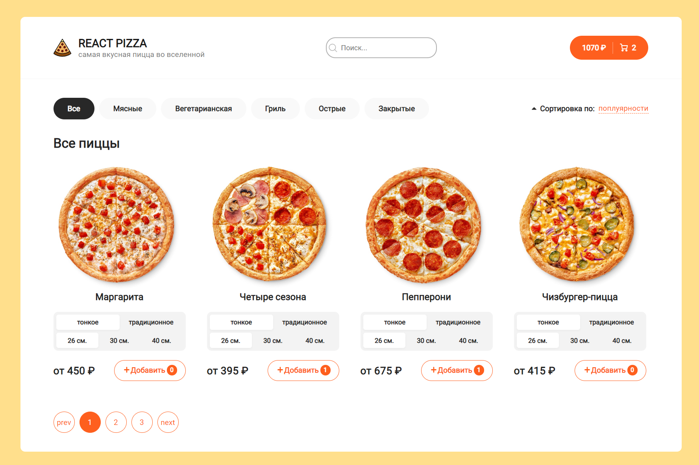
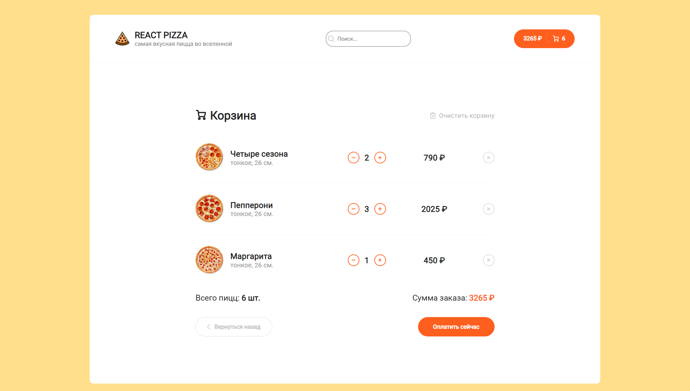

<h1 align="center">React Pizza</h1>
<h2 align="center">Онлайн-магазин по заказу пицц</h2>


## Description <br>

Полноценное фронтенд-приложение на ReactJS.

Реализовано:

- Добавление товара в корзину с различными параметрами
- Фильтрация и сортировка товаров по: популярности, цене, названию.
- Поиск товаров по названию.
- Навигация по странице без перезагрузки.
- Пагинация, для оторбражения следующих товаров.
- Корзина товаров:
  
  Также добавление и удаление товаров из корзины.

  ## Стек технологий: <br>

- ReactJS 18
- Redux Toolkit
- React Router v6
- Axios + Fetch
- React Hooks
- Prettier
- CSS-Modules / SCSS
- React Content Loader
- React Pagination
- Lodash.Debounce
- Code Splitting, React Loadable, useWhyDidYouUpdate <br>
  <br>
  Backend: <br>
- JSON-Server
  <br>
  <br>

## Project setup

```
npm install
npm run dev
```

## Future scope<br>

- Добавление TypeScript
- Добавление оплаты заказа
